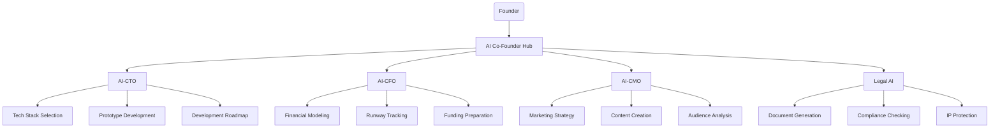
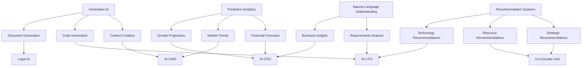
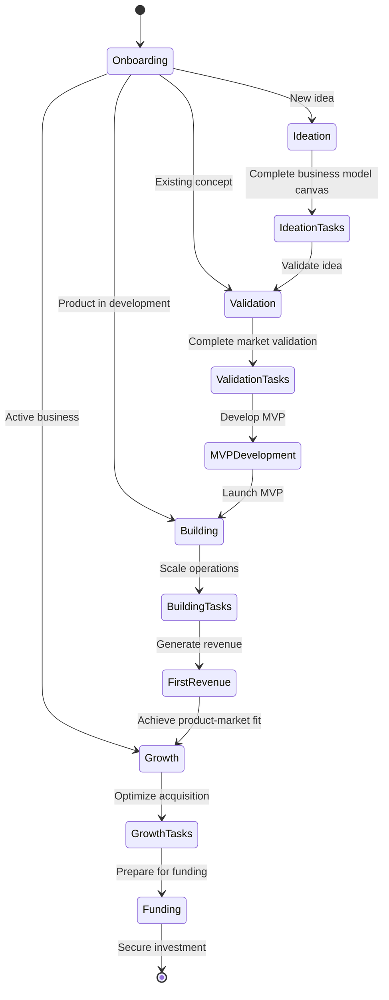
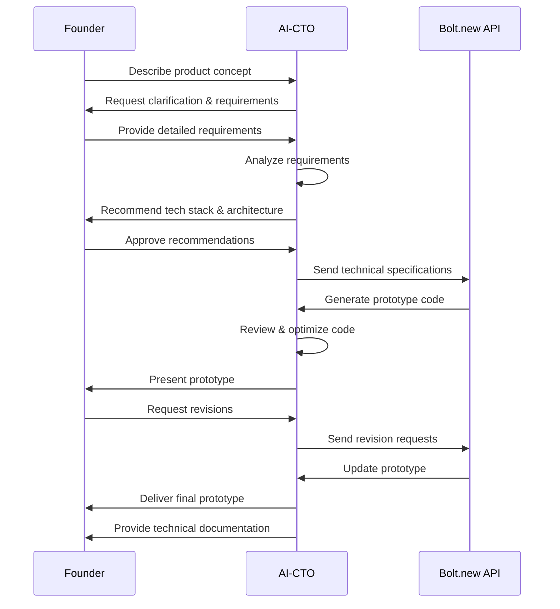
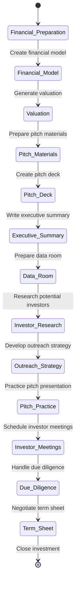
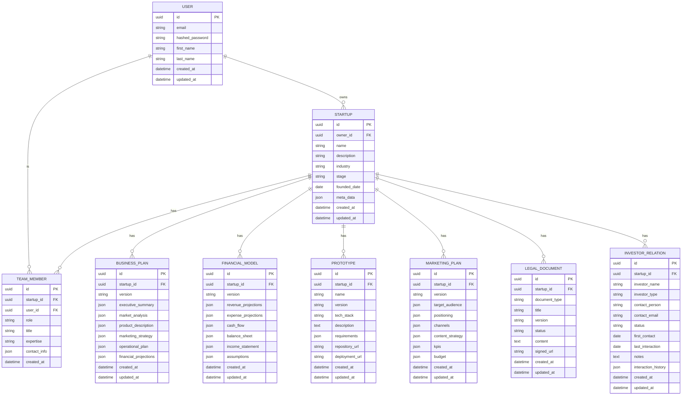
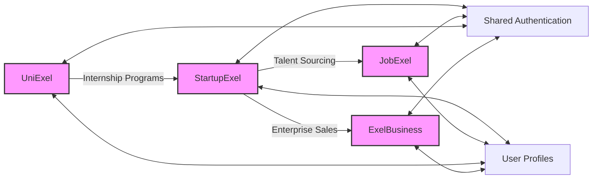

# StartupExel 🚀

<div align="center">
  
  
  [](LICENSE)
  [](VERSION)
  [](https://reactjs.org/)
  [](https://nextjs.org/)
  [](https://www.typescriptlang.org/)
  [](https://tailwindcss.com/)
  
  <h3>AI-powered co-founders transforming visionary ideas into thriving, data-driven startup ventures</h3>
</div>

## 📋 Table of Contents

- [Introduction](#-introduction)
- [Core Features](#-core-features)
- [AI Co-Founder Hub](#-ai-co-founder-hub)
- [System Architecture](#-system-architecture)
- [User Flows](#-user-flows)
- [Technical Stack](#-technical-stack)
- [Database Schema](#-database-schema)
- [API Reference](#-api-reference)
- [Getting Started](#-getting-started)
- [Development Guide](#-development-guide)
- [Deployment](#-deployment)
- [Integration with Exel Ecosystem](#-integration-with-exel-ecosystem)
- [Contributing](#-contributing)
- [License](#-license)
- [Support](#-support)

## 🌟 Introduction

StartupExel is a comprehensive platform designed to guide entrepreneurs through every stage of the startup journey, from initial ideation to sustainable growth. Our mission is to democratize entrepreneurship by providing AI-powered tools that level the playing field, enabling founders to compete effectively regardless of their background or connections.

<div align="center">
  
</div>

### Why StartupExel? 🤔

The startup landscape is challenging, with founders facing numerous obstacles:

- **📊 Information Asymmetry**: First-time founders lack critical insights that experienced entrepreneurs take for granted
- **💰 Resource Constraints**: Limited funds to hire specialized team members across different domains
- **⏱️ Time Pressure**: Need to move quickly despite knowledge gaps
- **🧠 Cognitive Overload**: Too many decisions across unfamiliar domains

StartupExel addresses these challenges by providing AI co-founders that offer domain expertise, data-driven insights, and automation of routine tasks—allowing human founders to focus on vision and strategy.

## ✨ Core Features

### 📝 Business Planning Suite

Comprehensive tools for business model development, market research, competitive analysis, and strategic planning.

<div align="center">
  
</div>

```typescript
// Example: Business model validation algorithm
interface BusinessModelValidation {
  viabilityScore: number;
  strengthAreas: string[];
  vulnerabilities: string[];
  recommendations: string[];
}

const validateBusinessModel = async (
  businessModel: BusinessModelCanvas,
  industry: string,
  targetMarket: string
): Promise<BusinessModelValidation> => {
  // Extract core elements of the business model
  const { valueProposition, customerSegments, revenueStreams, costStructure } = businessModel;
  
  // Analyze business model against industry benchmarks
  const industryBenchmarks = await fetchIndustryBenchmarks(industry);
  const marketData = await fetchMarketData(targetMarket);
  
  // Calculate viability score based on multiple factors
  const viabilityScore = calculateViabilityScore(
    businessModel, 
    industryBenchmarks, 
    marketData
  );
  
  // Generate insights
  const strengthAreas = identifyStrengths(businessModel, industryBenchmarks);
  const vulnerabilities = identifyVulnerabilities(businessModel, industryBenchmarks);
  const recommendations = generateRecommendations(vulnerabilities, marketData);
  
  return {
    viabilityScore,
    strengthAreas,
    vulnerabilities,
    recommendations
  };
};
```

### 💻 AI-CTO

Transform business requirements into functional prototypes without technical co-founders.

<div align="center">
  
</div>

**Key Capabilities:**
- 📋 Requirements analysis and refinement
- 🛠️ Tech stack recommendations based on project needs
- 🧩 Architecture planning and system design
- 📱 Working prototype generation through Bolt.new integration
- 👨‍💻 Technical roadmap creation and resource estimation

### 💰 AI-CFO

Financial modeling, runway monitoring, and funding preparation with AI assistance.

```typescript
// Example: Runway calculation with burn rate analysis
interface RunwayAnalysis {
  months: number;
  burnRate: number;
  criticalDate: Date;
  optimizationSuggestions: {
    area: string;
    potentialSavings: number;
    implementationDifficulty: 'easy' | 'medium' | 'hard';
    description: string;
  }[];
}

const calculateRunway = (
  currentBalance: number,
  financialData: FinancialData[],
  projectedExpenses: ProjectedExpense[]
): RunwayAnalysis => {
  // Calculate average burn rate from recent months
  const recentMonths = financialData.slice(-3);
  const averageBurnRate = calculateAverageBurnRate(recentMonths);
  
  // Adjust for upcoming projected expenses
  const adjustedBurnRate = adjustForProjectedExpenses(
    averageBurnRate, 
    projectedExpenses
  );
  
  // Calculate runway in months
  const runwayMonths = currentBalance / adjustedBurnRate;
  
  // Determine critical date when funds run out
  const criticalDate = addMonthsToDate(new Date(), runwayMonths);
  
  // Generate optimization suggestions to extend runway
  const optimizationSuggestions = generateBurnRateOptimizations(
    financialData,
    projectedExpenses
  );
  
  return {
    months: runwayMonths,
    burnRate: adjustedBurnRate,
    criticalDate,
    optimizationSuggestions
  };
};
```

### 📣 AI-CMO

Develop marketing strategies and content with data-driven insights.

### ⚖️ Legal AI

Create necessary legal documents and ensure compliance across jurisdictions.

### 💸 Funding Tools

Prepare for fundraising and track investor relationships.

<div align="center">
  
</div>

### 📊 Growth Analytics

Monitor traction and key business metrics with actionable insights.

### 👥 Mentorship Network

Connect with advisors and mentors in your industry for personalized guidance.

## 🧠 AI Co-Founder Hub

The AI Co-Founder Hub is the central command center for interacting with StartupExel's specialized AI assistants.



### AI Integration Architecture

StartupExel leverages advanced AI technologies to provide specialized expertise across multiple domains:



## 🏗️ System Architecture

StartupExel follows a modern microservices architecture with clear separation of concerns, ensuring scalability and maintainability.

```mermaid
graph TD
    Client[Client Application] --> Gateway[API Gateway]
    Gateway --> Auth[Auth Service]
    Gateway --> User[User Profile Service]
    Gateway --> Planning[Business Planning Service]
    Gateway --> Financial[Financial Service]
    Gateway --> Marketing[Marketing Service]
    Gateway --> Legal[Legal Service]
    Gateway --> Analytics[Analytics Service]
    Gateway --> AI[AI Orchestration Service]
    
    subgraph "Data Layer"
        User --> UserDB[(User Database)]
        Planning --> BusinessDB[(Business Documents)]
        Financial --> FinancialDB[(Financial Database)]
        Marketing --> MarketingDB[(Marketing Database)]
        Legal --> LegalDB[(Legal Documents)]
        Analytics --> AnalyticsDB[(Analytics Database)]
    end
    
    subgraph "External Integrations"
        AI --> OpenAI[OpenAI API]
        AI --> BoltAPI[Bolt.new API]
        Financial --> PaymentAPI[Payment Processors]
        Marketing --> MarketingTools[Marketing Tools]
        Legal --> LegalResources[Legal Resources]
    end
    
    subgraph "Background Processing"
        BackgroundJobs[Background Jobs]
        Gateway --> BackgroundJobs
        BackgroundJobs --> Notifications[Notification Service]
        BackgroundJobs --> Metrics[Metrics Aggregation]
    end
```



## 👤 User Flows

### Startup Journey Flow

The platform guides founders through a structured startup journey with customized paths based on their business type and stage.



### Prototype Development Flow



### Funding Preparation Flow



## 🛠️ Technical Stack

### Frontend
- **Next.js**: React framework for server-rendered applications
- **React**: Component-based UI library
- **TypeScript**: Type-safe JavaScript
- **TailwindCSS**: Utility-first CSS framework
- **shadcn/ui**: Component library built on Radix UI
- **Zustand**: Lightweight state management
- **React Query**: Data fetching and caching
- **Recharts**: Data visualization

### Backend
- **Node.js**: JavaScript runtime
- **Express**: Web framework
- **tRPC**: End-to-end typesafe APIs
- **Prisma**: ORM for database access
- **PostgreSQL**: Primary database for structured data
- **MongoDB**: Document database for unstructured content
- **Redis**: Caching and session management

### AI & ML
- **OpenAI API**: For natural language understanding and generation
- **Bolt.new API**: For prototype code generation
- **Langchain**: For complex AI workflows
- **TensorFlow.js**: For client-side ML models

### DevOps
- **Docker**: Containerization
- **GitHub Actions**: CI/CD
- **Vercel**: Deployment platform
- **Jest**: Testing framework
- **Cypress**: End-to-end testing

## 🗄️ Database Schema

StartupExel uses a sophisticated database schema to represent startup-related entities.



## 📡 API Reference

StartupExel provides a comprehensive API for integration with other services and extensions.

### Authentication

```typescript
/**
 * User authentication
 * POST /api/auth/login
 */
interface LoginRequest {
  email: string;
  password: string;
}

interface LoginResponse {
  token: string;
  user: {
    id: string;
    email: string;
    name: string;
  };
}
```

### Startup Management

| Endpoint | Method | Description |
|----------|--------|-------------|
| `/api/startups` | GET | Get all user startups |
| `/api/startups/:id` | GET | Get specific startup |
| `/api/startups` | POST | Create a new startup |
| `/api/startups/:id` | PUT | Update a startup |
| `/api/startups/:id/team` | GET | Get startup team |
| `/api/startups/:id/metrics` | GET | Get startup metrics |

### AI Services

| Endpoint | Method | Description |
|----------|--------|-------------|
| `/api/ai/cto/analyze` | POST | Analyze technical requirements |
| `/api/ai/cto/prototype` | POST | Generate prototype |
| `/api/ai/cfo/model` | POST | Generate financial model |
| `/api/ai/cfo/runway` | GET | Calculate runway |
| `/api/ai/cmo/strategy` | POST | Generate marketing strategy |
| `/api/ai/legal/document` | POST | Generate legal document |

Full API documentation is available at the `/api/docs` endpoint when running the development server.

## 🚀 Getting Started

### Prerequisites

- Node.js (v18+)
- npm or pnpm
- PostgreSQL database
- OpenAI API key
- Bolt.new API key

### Installation

```bash
# Clone the repository
git clone https://github.com/exel/startup-exel.git
cd startup-exel

# Install dependencies
npm install
# or
pnpm install

# Set up environment variables
cp .env.example .env.local
# Edit .env.local with your database and API credentials

# Run database migrations
npm run migrate
# or
pnpm migrate

# Start development server
npm run dev
# or
pnpm dev
```

### Environment Variables

| Variable | Description | Required |
|----------|-------------|----------|
| `DATABASE_URL` | PostgreSQL connection string | Yes |
| `NEXTAUTH_SECRET` | Secret for NextAuth.js | Yes |
| `OPENAI_API_KEY` | OpenAI API key for AI assistants | Yes |
| `BOLT_API_KEY` | Bolt.new API key for prototype generation | Yes |
| `NEXT_PUBLIC_APP_URL` | Base URL for the application | Yes |

## 💻 Development Guide

### Project Structure

```
startup-exel/
├── public/                # Static assets
├── src/
│   ├── app/               # Next.js App Router pages
│   ├── components/        # React components
│   │   ├── ui/            # Base UI components
│   │   ├── features/      # Feature-specific components
│   │   └── layout/        # Layout components
│   ├── hooks/             # Custom React hooks
│   ├── lib/               # Utility functions
│   ├── services/          # External service integrations
│   │   ├── ai/            # AI assistant services
│   │   ├── auth/          # Authentication
│   │   └── api/           # API client
│   ├── styles/            # Global styles
│   └── types/             # TypeScript type definitions
├── prisma/                # Database schema and migrations
│   ├── schema.prisma      
│   └── migrations/     
├── scripts/               # Utility scripts
├── tests/                 # Test files
├── .env.example           # Example environment variables
└── package.json           # Dependencies and scripts
```

### Development Workflow

#### Branch Naming

- `feature/feature-name` - For new features
- `fix/issue-description` - For bug fixes
- `chore/task-description` - For maintenance tasks

#### Commit Messages

We follow [Conventional Commits](https://www.conventionalcommits.org/) specification:

```
feat: add AI-CFO financial projection tool
fix: correct calculation in runway estimation
docs: update README with new setup instructions
```

### Example Component

```tsx
// src/components/features/runway/RunwayCalculator.tsx
import React from 'react';
import { Card, CardHeader, CardTitle, CardContent } from '@/components/ui/card';
import { Progress } from '@/components/ui/progress';
import { Button } from '@/components/ui/button';
import { CalendarIcon, TrendingDownIcon, AlertCircleIcon } from 'lucide-react';

interface RunwayCalculatorProps {
  currentBalance: number;
  monthlyBurn: number;
  runway: number;
  criticalDate: Date;
}

export const RunwayCalculator: React.FC<RunwayCalculatorProps> = ({
  currentBalance,
  monthlyBurn,
  runway,
  criticalDate
}) => {
  const formatCurrency = (amount: number) => {
    return new Intl.NumberFormat('en-US', {
      style: 'currency',
      currency: 'USD',
      maximumFractionDigits: 0
    }).format(amount);
  };
  
  const formatDate = (date: Date) => {
    return new Intl.DateTimeFormat('en-US', {
      year: 'numeric',
      month: 'long',
      day: 'numeric'
    }).format(date);
  };
  
  const getRunwayColor = () => {
    if (runway > 12) return 'bg-green-500';
    if (runway > 6) return 'bg-yellow-500';
    return 'bg-red-500';
  };
  
  return (
    <Card>
      <CardHeader>
        <CardTitle className="flex items-center">
          <CalendarIcon className="mr-2 h-5 w-5 text-blue-500" />
          Runway Calculator
        </CardTitle>
      </CardHeader>
      <CardContent className="space-y-4">
        <div className="flex justify-between items-center">
          <div>
            <p className="text-sm text-slate-500">Current Balance</p>
            <p className="text-xl font-bold">{formatCurrency(currentBalance)}</p>
          </div>
          <div>
            <p className="text-sm text-slate-500">Monthly Burn</p>
            <p className="text-xl font-bold text-amber-600">
              {formatCurrency(monthlyBurn)}
            </p>
          </div>
        </div>
        
        <div>
          <div className="flex justify-between items-center mb-1">
            <p className="text-sm font-medium">Runway</p>
            <p className="text-sm font-medium">{runway.toFixed(1)} months</p>
          </div>
          <Progress value={(runway / 18) * 100} className={`h-2 ${getRunwayColor()}`} />
        </div>
        
        <div className="bg-amber-50 p-3 rounded-md flex items-start">
          <AlertCircleIcon className="h-5 w-5 text-amber-600 mt-0.5 mr-2 flex-shrink-0" />
          <p className="text-sm text-amber-800">
            At current burn rate, funds will be depleted by <strong>{formatDate(criticalDate)}</strong>.
            Consider optimizing expenses or planning for fundraising.
          </p>
        </div>
        
        <div className="flex space-x-2">
          <Button variant="outline" className="flex-1">
            <TrendingDownIcon className="h-4 w-4 mr-2" />
            Reduce Burn
          </Button>
          <Button className="flex-1">Funding Options</Button>
        </div>
      </CardContent>
    </Card>
  );
};
```

## 🚢 Deployment

### Vercel Deployment

```bash
# Install Vercel CLI
npm install -g vercel

# Deploy to Vercel
vercel
```

### Docker Deployment

```bash
# Build Docker image
docker build -t startup-exel .

# Run Docker container
docker run -p 3000:3000 -e DATABASE_URL=YOUR_DB_URL startup-exel
```

## 🔄 Integration with Exel Ecosystem

StartupExel is part of the broader Exel ecosystem, which includes:



### Integration Points

- **Shared Authentication**: Single sign-on across all Exel products
- **User Profiles**: Unified user data with specialized views per product
- **Cross-product Journeys**: Seamless transitions between products
- **Data Synchronization**: Relevant data sharing between platforms
- **Consistent UX**: Familiar interface patterns across the ecosystem

## 👥 Contributing

We welcome contributions to StartupExel! Please follow these steps:

1. Fork the repository
2. Create your feature branch (`git checkout -b feature/amazing-feature`)
3. Commit your changes (`git commit -m 'feat: add amazing feature'`)
4. Push to the branch (`git push origin feature/amazing-feature`)
5. Open a Pull Request

Please follow our coding standards and include appropriate tests.

## 📄 License

This project is proprietary and confidential. Unauthorized copying, transfer, or reproduction of the contents is strictly prohibited.

## 🆘 Support

For support, please contact:
- Email: dev@exel.com
- Documentation: [docs.exel.com/startup-exel](https://docs.exel.com/startup-exel)
- Issues: Create an issue in this repository

---

<div align="center">
  <p>Built with ❤️ by Ian Kuria (www.kuria.pro) - Software Engineer -  the Exel Team</p>
  <p>
    <a href="https://twitter.com/exelhq">Twitter</a> •
    <a href="https://linkedin.com/company/exelhq">LinkedIn</a> •
    <a href="https://exel.com">Website</a>
  </p>
</div>
